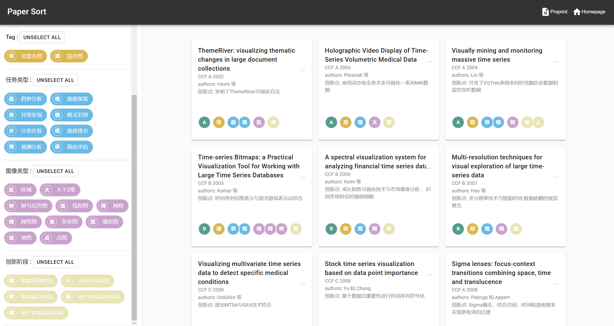

---

# 时序数据可视化综述  

本网站展示了我们对 **时序数据可视化方法** 的综述，收录了目前领域内的 **78 篇代表性论文**，并支持用户通过多种维度进行探索与筛选。我们将持续更新内容，添加更多最新成果，欢迎持续关注！  

  

---
 
## 网站功能  
- **论文统计与筛选**  
  - 支持按年份（year）、发表会议/期刊（venue）、标签（tag）进行统计。  
  - 支持筛选论文类型，包括不同任务类型、图像类型和创新阶段。  
- **交互式浏览**  
  - 每篇论文均附带关键信息（标题、年份、作者等）。  
  - 点击论文卡片可直接跳转至Google按照论文标题进行搜索。  
- **动态更新**  
  - 网站数据基于 `assets/papers.json` 文件，后续内容更新将快速上线。  

---

## 在线访问  
网站已托管于 GitHub Pages，点击以下链接直接访问：
[**时序数据可视化综述网站**](https://github.com/ML98K3/interactive-survey-template)

---

## 致谢  
本网站基于 [Interactive Survey Template](https://github.com/Visual-Intelligence-UMN/interactive-survey-template) 模板进行开发，感谢模板提供者的支持！  

---
